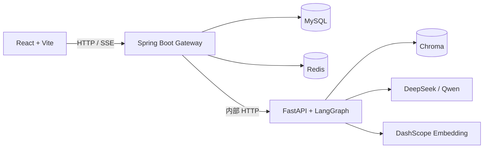

# Mneme

> 一个支持结构化 RAG、三级记忆与可追溯引用的开源个人学习助手。


[](https://github.com/CoderDongHuang/Mneme/actions/workflows/ci.yml)


Mneme 面向需要长期学习和资料管理的用户。它不仅回答单次问题，还会从对话中沉淀表达偏好、知识薄弱点和学习进度，并在后续回答与复习建议中使用这些记忆。

> 当前状态：面向个人与小规模团队的本地自部署版本。核心学习闭环、中文 OCR、本地邮件、RAG 评测和真实全链路验收入口均已提供；图表与流程图理解按需启用多模态模型。

## 功能概览

- **账号与工作区**：注册、登录、资料库、对话历史、个人资料和学习工作台。
- **结构化 RAG**：支持 PDF、DOCX、PPTX、XLSX/XLSM、CSV、Markdown、TXT 和 HTML。
- **复杂文档解析**：PDF 版面块排序、重复页眉页脚过滤、逐页中英文 OCR、表格独立提取，可选 Qwen-VL 图表与图片理解。
- **可追溯回答**：保留文档名、页码、章节、内容类型和原文片段，并在回答中展示引用。
- **Agent 决策链**：LangGraph 编排意图识别、条件检索、个性化推理和记忆回写。
- **三级记忆**：工作记忆、短期会话记忆、长期偏好/薄弱点/进度记忆。
- **记忆质量控制**：高置信度自动写入，中置信度由用户确认，低置信度丢弃。
- **流式输出**：Python 生成 SSE，Java Gateway 转发，React 前端逐步渲染。
- **模型容错**：DeepSeek 主模型与 Qwen 备用模型，支持失败切换、熔断和恢复探测。

## 系统架构



浏览器只访问 Java Gateway。Java 负责认证、业务数据和服务编排；Python 负责 Agent 推理、RAG 与语义记忆；MySQL 是业务事实来源，Redis 与 Chroma 分别承载短期状态和向量数据。

## Docker 自部署

### 环境要求

- Docker Desktop，或 Docker Engine + Compose v2
- DeepSeek API Key
- DashScope API Key（Embedding 必需，同时可用于 Qwen 备用模型）
- 建议至少 4 核 CPU、8 GB 内存和 20 GB 可用磁盘

### 1. 获取项目

```bash
git clone https://github.com/CoderDongHuang/Mneme.git
cd Mneme
cp .env.example .env
```

Windows PowerShell 使用：

```powershell
Copy-Item .env.example .env
```

### 2. 配置 `.env`

至少修改以下配置，三个密钥不要复用：

```dotenv
DEEPSEEK_API_KEY=你的_deepseek_key
DASHSCOPE_API_KEY=你的_dashscope_key
MYSQL_ROOT_PASSWORD=一个强数据库密码
SPRING_DATASOURCE_PASSWORD=与上面相同
JWT_SECRET=至少32字节随机字符串
INTERNAL_SERVICE_TOKEN=另一个至少32字节随机字符串
```

### 3. 启动完整项目

```bash
docker compose -f docker-compose.yml -f docker-compose.selfhost.yml up -d --build
```

打开 <http://localhost:3000>，注册账号后即可创建资料库、上传资料并开始对话。

密码重置邮件保存在本机 Mailpit，访问 <http://localhost:8025> 查看，无需配置公网 SMTP。

```bash
# 查看状态
docker compose -f docker-compose.yml -f docker-compose.selfhost.yml ps

# 查看日志
docker compose -f docker-compose.yml -f docker-compose.selfhost.yml logs -f

# 停止服务（保留数据）
docker compose -f docker-compose.yml -f docker-compose.selfhost.yml down
```

数据默认保存在 `data/mysql`、`data/redis`、`data/chroma` 和 `data/files`。不要使用 `down -v`，除非确认要删除数据。

更完整的配置、OCR 和故障排查见 [Docker 自部署指南](docs/SELF_HOSTING.md)。需要域名与 HTTPS 时再使用 [公网部署说明](docs/PRODUCTION_DEPLOYMENT.md)。

## 本地开发

本地调试可让 Docker 只运行 MySQL、Redis 和 Chroma，再分别启动 Python、Java 和 React：

```powershell
docker compose up -d mysql redis chroma
./start.bat
```

详细环境与命令见 [开发与启动](docs/development.md)。

## 测试

```bash
# Python
cd python-agent
pip install -r requirements.txt -r requirements-dev.txt
python -m pytest tests -q
ruff check .

# Java
cd ../java-gateway
mvn test

# Frontend
cd ../frontend
npm ci
npm run lint
npm test
npm run build
```

CI 会分别执行 Python、Java 和前端检查。当前浏览器 E2E 主要验证 mock API 下的关键交互与响应式布局，真实模型、OCR 和跨服务全链路仍建议在本地按 [测试说明](docs/testing.md) 验收。

## 文档索引

- [架构设计说明书](架构设计说明书.md)
- [Docker 自部署指南](docs/SELF_HOSTING.md)
- [项目设计与实现博客](docs/MNEME_PROJECT_BLOG.md)
- [接口契约](docs/api.md)
- [文档解析与 RAG](docs/rag.md)
- [前端设计](docs/frontend.md)
- [测试说明](docs/testing.md)
- [配置获取与参数说明](docs/SELF_HOSTING.md#2-配置与获取方式)
- [ADR：服务与数据边界](docs/adr/0001-service-and-data-boundaries.md)

`全阶段开发步骤.md` 和 `调试问题记录.md` 是历史过程记录，不代表当前实现状态。

## 使用边界

- 默认模式优先使用本地版面解析和 OCR；图表、公式、图片与流程图需要设置 `MULTIMODAL_ENABLED=true`，会消耗 DashScope 多模态额度。
- Chroma 与本地文件目录针对个人和小规模自部署设计，正好覆盖本项目当前定位。
- Mailpit 是本地测试邮箱，不会向真实邮箱投递；验证码在 `http://localhost:8025` 查看。
- 尚未提供插件市场和模型供应商可视化配置，模型参数统一在 `.env` 管理。

## 开源协议

本项目采用 [MIT License](LICENSE)。
