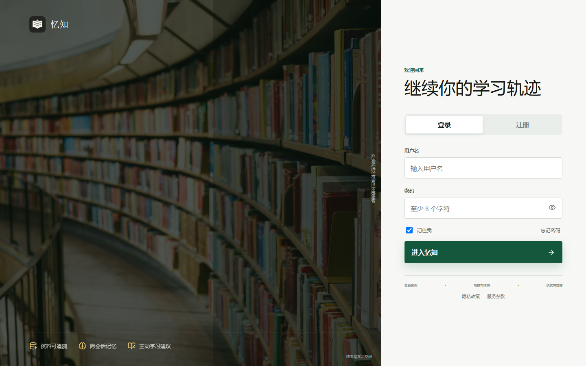
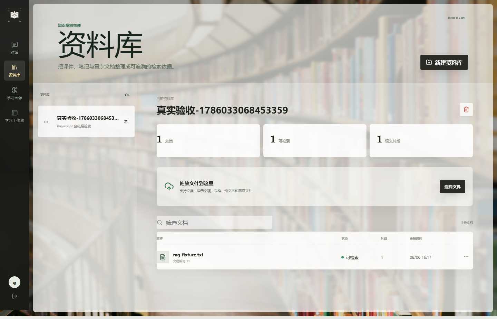
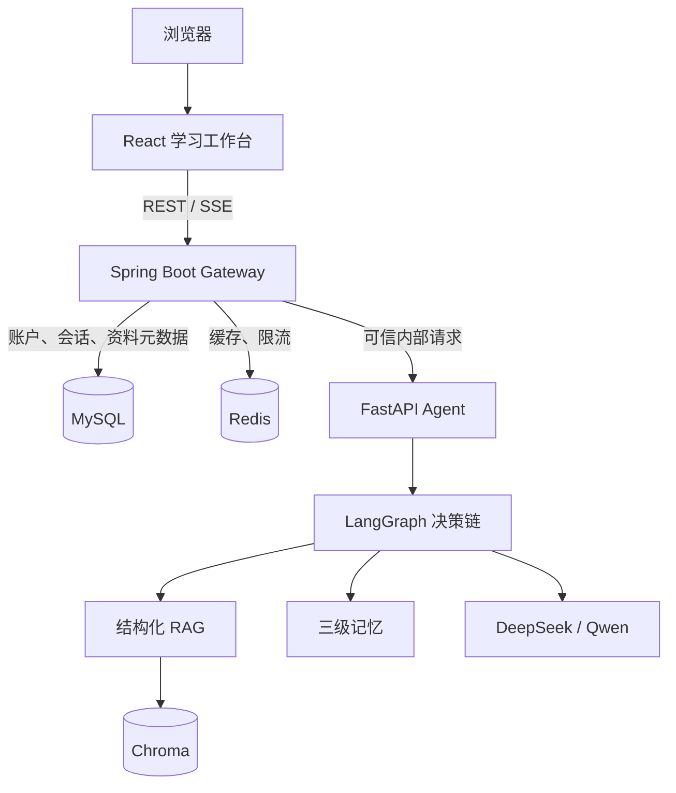
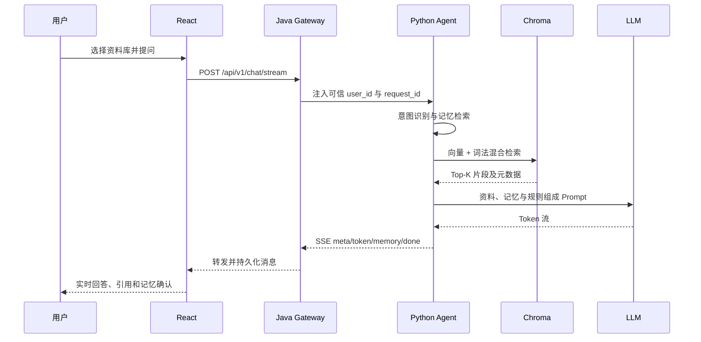
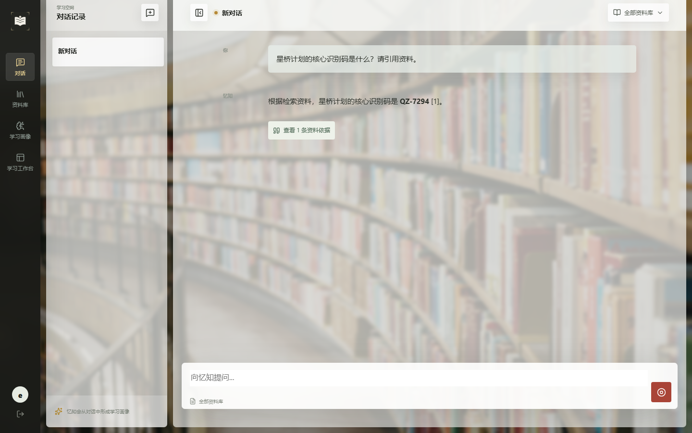
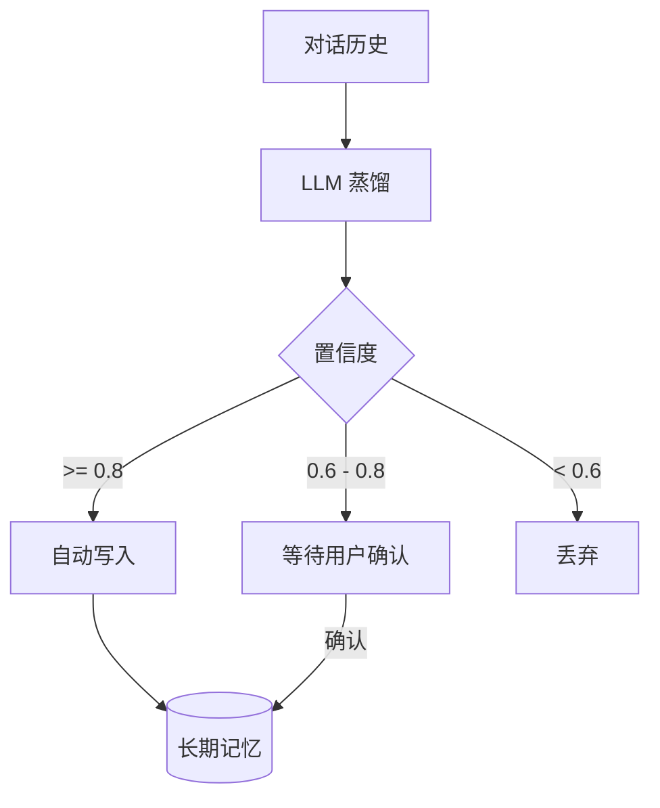

# Mneme：一个会记住你的开源个人学习助手


多数知识库问答工具完成的是一次检索：上传文件、输入问题、返回答案。但真实学习是连续过程。用户会在不同会话中暴露自己的表达偏好、反复卡住的知识点和当前学习进度。Mneme 希望把资料、对话与长期学习状态连接起来，让 Agent 不只“找到资料”，还能够“记住你、理解你、持续帮助你”。

Mneme 是一个面向个人和小规模团队自托管的开源 Beta 项目。它由 React 学习工作台、Spring Boot 业务网关和 FastAPI AI Agent 三部分组成，覆盖账户、资料库、结构化文档解析、RAG、流式对话、三级记忆、学习画像和 Docker 一键启动。本文会从产品目标、架构边界、关键实现、真实 E2E、踩坑过程和后续路线完整说明这个项目。



## 一、项目解决什么问题

Mneme 的目标不是再做一个通用聊天框，而是围绕“个人资料驱动的持续学习”建立闭环：

1. 用户上传课件、笔记、论文、报告或简历后，系统基于资料回答，而不是脱离文档泛泛而谈。
2. 回答携带文档名、页码、章节和原文片段，用户可以回到证据核验。
3. 系统从多轮交流中提取学习偏好、薄弱点和进度，并允许用户确认或拒绝不确定记忆。
4. 会话、资料和记忆按用户隔离；浏览器不能通过伪造 `user_id` 读取他人的数据。
5. 所有服务可以在本地 Docker 中运行，不要求购买域名或部署公网。

典型使用流程是：注册账号，创建资料库，上传文档，等待解析完成，选择资料库提问，然后在引用抽屉中核验答案依据。随着对话积累，用户可以在记忆页检查系统形成的学习画像。



## 二、为什么拆成 React、Java 和 Python

Mneme 没有把所有逻辑堆进一个服务。三端分别承担稳定的职责边界：



### React：用户工作台

前端使用 React 19、Vite、React Router 和 React Markdown。页面包括注册登录、对话、资料库、记忆管理、学习画像等。对话通过 `fetch + ReadableStream` 消费 POST SSE，能够展示生成状态、逐字回答、引用、候选记忆，并支持主动停止生成。

### Spring Boot：可信业务边界

Java 是浏览器唯一访问的业务入口，负责 JWT、安全 Cookie、用户隔离、会话消息、文件保存、资料元数据、任务状态、限流、审计和 Python 流式响应转发。MySQL 结构由 Flyway 管理，避免依赖手工初始化。

这里有一个关键安全点：客户端即使提交自己的 `user_id`，Java 也会用 JWT 对应的身份覆盖它。

```java
@PostMapping(value = "/stream", produces = MediaType.TEXT_EVENT_STREAM_VALUE)
public ResponseEntity<StreamingResponseBody> chatStream(
    @RequestAttribute("userId") Long userId,
    @Valid @RequestBody ChatRequest request
) {
    request.setUserId(userId.toString());
    ensureRequestId(request);
    return ResponseEntity.ok()
        .contentType(MediaType.TEXT_EVENT_STREAM)
        .header("X-Accel-Buffering", "no")
        .body(chatService.stream(userId, request));
}
```

Python 只信任携带内部服务令牌的 Java 请求。这个边界比让浏览器直接访问 Python 更容易统一认证、限流和审计。

### FastAPI：AI 能力层

Python 集中实现 LangGraph 编排、文档解析、切片、Embedding、混合检索、Prompt 构建、模型调用、记忆蒸馏和反思。Chroma 保存知识片段和长期语义记忆；Redis 保存可恢复的短期会话状态。

## 三、一条问题如何得到答案



LangGraph 将请求路由到 `qa`、`review`、`suggest` 或 `general`。资料问答进入知识检索；回顾问题读取历史记忆；学习建议结合薄弱点和进度；普通交流使用近期上下文。路由不是为了堆节点，而是让每种任务取得恰当的上下文，避免把全部资料和全部记忆都塞进一次 Prompt。

Prompt 的核心约束是：资料存在时优先依据资料；依据不足时明确说明；使用编号引用；记忆只能影响表达方式和学习建议，不能覆盖资料事实。这样可以减少“为了照顾用户偏好而改变事实”的风险。

## 四、文档解析不是简单的 PDF 转文本

Mneme 支持 PDF、DOCX、PPTX、XLSX/XLSM、CSV、Markdown、TXT 和 HTML。不同格式采用不同结构恢复策略：

| 格式 | 解析策略 |
|---|---|
| PDF | 页面文本块排序、表格抽取、重复页眉页脚过滤、低文本页 OCR |
| DOCX | 标题层级、正文段落、表格及内嵌图片 |
| PPTX | 幻灯片页码、标题、文本框、表格及内嵌图片 |
| XLSX/XLSM | 工作表与行列转为结构化文本 |
| CSV | 表头与数据行保留列关系 |
| MD/TXT/HTML | 保留自然段、标题和章节边界 |

### PDF 的四步处理

1. **识别页面类型**：原生文本页直接抽取；文本不足的扫描页进入 Tesseract OCR；图文混排页可按配置进入视觉模型。
2. **还原结构**：使用 PyMuPDF 读取文本块并按坐标排序，保留页码；使用 pdfplumber 单独提取表格；统计跨页重复文本并过滤页眉页脚。
3. **语义切片**：标题与正文保持邻接，表格作为独立结构块，每个 chunk 携带文档 ID、页码、章节和类型。
4. **保留溯源**：Embedding 写入 Chroma 时元数据一并保存，检索结果可以直接映射到前端引用。

解析入口会拒绝“成功但没有任何可检索文本”的假成功：

```python
documents = load_document(file_path)
documents = [doc for doc in documents if doc.page_content.strip()]
if not documents:
    raise ValueError("文档中没有可检索的文本；扫描件请启用 OCR 后重试")

chunks = split_documents(documents)
vector_store.add_documents(chunks, ids=chunk_ids)
```

Docker 镜像安装了 `tesseract-ocr-chi-sim` 和英文语言包，默认 `OCR_LANGUAGES=chi_sim+eng`。`PDF_MIN_TEXT_CHARS` 控制何时启用 OCR，避免文本型 PDF 被重复识别。

### 多模态解析及成本控制

图表、公式、流程图和页面图片不能只靠 OCR。设置 `MULTIMODAL_ENABLED=true` 后，系统会把有限数量的页面或 Office 内嵌图片交给 Qwen-VL 描述，并把描述作为可检索结构块。`MULTIMODAL_MAX_IMAGES` 限制单文档调用数量，防止复杂课件无上限消耗额度。

这项能力仍有边界：视觉模型输出需要通过页码和原图人工核验，复杂公式转写和密集财报表格尚不能宣称百分之百准确。

## 五、RAG：向量召回与词法召回融合

只用向量检索时，型号、编号、姓名和代码这类精确 token 可能召回不稳定。Mneme 同时进行语义检索和轻量词法检索，再按文档 ID 合并分数：

```python
semantic = collection.query(
    query_embeddings=[embeddings.embed_query(query)],
    n_results=max(top_k * 2, top_k),
    where=where,
)
lexical = _lexical_candidates(query, where)

for item in lexical:
    if item["id"] in merged:
        merged[item["id"]]["score"] = min(
            1.0, merged[item["id"]]["score"] * 0.75 + item["score"] * 0.25
        )
```

这不是最终形态的搜索引擎，但比纯向量检索更适合个人文档中的专有名词。下一步可引入 BM25 索引、查询改写和 Cross Encoder 重排，并针对合同、论文、简历等文档类型建立独立评测集。

进入 Prompt 的片段按 `[1]`、`[2]` 编号，引用元数据通过 SSE 一起送到前端。下图来自真实 Docker 全链路测试：虚构资料中的唯一编号 `QZ-7294` 被检索并在回答中正确引用，而不是由 mock API 生成。



## 六、三级记忆如何协作

| 层级 | 生命周期 | 内容 | 存储 |
|---|---|---|---|
| 工作记忆 | 当前请求窗口 | 最近若干条消息和本次检索上下文 | Python 内存 |
| 短期记忆 | 会话级 | 完整历史、增量摘要、冷却时间 | Redis，可降级到内存 |
| 长期记忆 | 跨会话 | 偏好、薄弱点、学习进度 | Chroma |

长期记忆不能把模型的每次猜测直接写入。Mneme 先蒸馏候选记忆，再按置信度处理：高置信度自动写入，中等置信度在前端显示确认卡片，低置信度丢弃。用户可以查看、确认和删除记忆，避免错误画像持续污染后续回答。



Redis 不可用时，短期记忆会记录警告并退回进程内存，核心对话仍可继续；代价是服务重启后该会话上下文丢失。这是明确的可用性降级，不是静默假装已经持久化。

## 七、模型主备与熔断

模型客户端延迟初始化，因此没有 API Key 时服务仍能启动，并在 readiness 中报告不可用。主模型默认 DeepSeek，备用模型可配置为 Qwen。连续失败达到阈值后熔断主模型，在恢复窗口结束后重新探测。

流式请求有一个容易忽略的约束：只有在尚未向用户发送任何 token 时才能切换备用模型。如果主模型已经输出半句话，再从备用模型重头生成会拼出语义冲突的答案，因此代码明确阻止这种切换：

```python
async def astream(self, messages, **kwargs):
    emitted = False
    try:
        async for chunk in model.astream(messages, **kwargs):
            emitted = True
            yield chunk
    except Exception as error:
        if using_fallback or emitted:
            raise
        self._record_failure(error)
        async for chunk in fallback.astream(messages, **kwargs):
            yield chunk
```

当前实现兼容 `invoke`、`ainvoke` 和 `astream`，并通过 Prometheus 指标记录主备调用结果。它解决的是供应商临时失败，不保证在两个供应商都不可用时继续生成答案。

## 八、SSE 与反向代理踩坑复盘

真实 E2E 第一次运行时，注册请求经 `http://localhost:3000/api/...` 返回 405。Java 和 Python 都正常，问题出在 Caddy：SPA 的 `try_files` 先把 `/api/*` 重写成 `/index.html`，POST 最终落到静态文件处理器。

修复方式是用互斥 `handle` 明确 API、WebSocket 和 SPA 的优先边界：

```caddy
handle /api/* {
    reverse_proxy java-gateway:8080
}
handle /ws/* {
    reverse_proxy java-gateway:8080
}
handle {
    root * /srv/frontend
    try_files {path} /index.html
    file_server
}
```

这个问题说明“容器健康”和“页面能打开”都不等于业务全链路可用。只有从浏览器入口执行注册、上传、解析、检索、模型生成和引用展示，才能发现代理顺序这类跨服务错误。

## 九、认证、邮件与本地自托管

忘记密码依赖 SMTP。为了让本地使用者无需先购买邮箱服务，Compose 默认包含 Mailpit：Java 将重置邮件投递到本地 SMTP，用户在 `http://localhost:8025` 查看邮件。它只用于本地测试，不会把邮件发往公网收件箱。

本地启动需要：

- Docker Desktop 或 Docker Engine + Compose Plugin
- DeepSeek API Key，用于主要对话模型
- DashScope API Key，用于 Embedding、备用模型和可选视觉理解
- 至少约 8 GB 可用内存，首次构建还需要下载镜像和依赖

复制配置模板：

```bash
git clone https://github.com/CoderDongHuang/Mneme.git
cd Mneme
cp .env.example .env
```

Windows PowerShell 使用：

```powershell
Copy-Item .env.example .env
```

至少填写以下配置：

```dotenv
DEEPSEEK_API_KEY=从 DeepSeek 开放平台获取
DASHSCOPE_API_KEY=从阿里云百炼获取
MYSQL_ROOT_PASSWORD=本地数据库强密码
SPRING_DATASOURCE_PASSWORD=与上面一致
JWT_SECRET=至少32字节随机字符串
INTERNAL_SERVICE_TOKEN=另一个至少32字节随机字符串
```

两个模型密钥的获取流程和每个变量的具体位置见 [本地自托管指南](SELF_HOSTING.md)。`.env` 已被 Git 忽略，不应提交到仓库。

启动完整栈：

```bash
docker compose -f docker-compose.yml -f docker-compose.selfhost.yml up -d --build
```

打开：

- Mneme：<http://localhost:3000>
- Mailpit：<http://localhost:8025>
- Java 健康检查：<http://localhost:8080/api/v1/health>
- Python 文档（仅本机调试）：<http://localhost:8000/docs>

持久化数据位于仓库的 `data/`，停止容器不会删除数据。不要执行 `docker compose down -v`，除非明确希望删除数据库卷。项目定位是本地和私有环境自托管，不要求域名、HTTPS 证书或公网服务器。

## 十、如何取得 API 配置

### DeepSeek

1. 登录 DeepSeek 开放平台并进入 API Keys。
2. 创建密钥并充值可用额度。
3. 将密钥写入根目录 `.env` 的 `DEEPSEEK_API_KEY`。
4. 默认模型为 `deepseek-chat`，可通过 `DEEPSEEK_MODEL` 修改。

### 阿里云百炼 DashScope

1. 登录阿里云百炼控制台并开通模型服务。
2. 创建 DashScope API Key。
3. 确认账号有 `text-embedding-v3` 的调用权限。
4. 将密钥写入 `.env` 的 `DASHSCOPE_API_KEY`。
5. 若启用图片理解，还需确认配置的 `MULTIMODAL_MODEL` 可用，并设置 `MULTIMODAL_ENABLED=true`。

### 本地邮件

默认无需申请 SMTP。`docker-compose.selfhost.yml` 使用 Mailpit 接收重置邮件。正式连接个人 SMTP 时，再覆盖 `SPRING_MAIL_HOST`、端口、用户名、密码和 TLS 配置。

## 十一、测试体系与真实结果

Mneme 将测试分为四层：

| 层级 | 工具 | 主要覆盖 |
|---|---|---|
| Python 单元/接口 | Pytest | 意图、记忆、文档解析、API、检索 |
| Java 单元/集成 | Maven、JUnit、Testcontainers | 服务、控制器、数据库边界 |
| 前端单元/E2E | Vitest、Playwright | API 客户端、页面流程和响应式布局 |
| RAG 评测 | 自定义评测脚本 | Hit@K、MRR、引用元数据完整率 |

本次发布前实测结果：

- Ruff：通过
- Python：67 tests passed
- Java：4 tests passed，1 个需要 Docker 的 Testcontainers 用例按环境跳过
- 前端单元测试：2 tests passed
- Mock Playwright：6 tests passed
- 离线 RAG：Hit@5 = 1.0、MRR = 1.0、引用元数据完整率 = 1.0
- 真实 Docker E2E：1 passed，约 25.7 秒

真实 E2E 使用虚构资料，实际经过注册、创建资料库、文件上传、DashScope Embedding、解析状态轮询、Chroma 检索、DeepSeek 流式回答和引用按钮展示。它不会默认在 GitHub Actions 中执行，因为真实模型调用会消耗额度；本地显式运行：

```bash
cd frontend
npm run test:e2e:real
```

离线基线数据集规模仍小，1.0 只表示当前固定样例全部命中，不能解释为任意真实文档都达到完美检索。项目文档保留这一区别，避免用漂亮数字替代真实质量判断。

## 十二、上一次 CI 失败为什么发生

GitHub Actions 运行 `31106946732` 对应 `codex/production-hardening` 分支。该次运行中 ESLint 和 Vitest 均通过，失败步骤是 `npm run audit`：间接依赖 `brace-expansion` 命中高危公告 `GHSA-rgw5-rvv9-x895`，`audit-ci` 按策略返回退出码 1。

本次将 `brace-expansion` 更新到 `5.0.9`，并将 `postcss` 更新到 `8.5.23`。React Router 对应公告仍按仓库已有安全策略显式 allowlist；这不是“没有漏洞”，而是维护者接受当前本地自托管场景的已知风险，后续升级路由栈时应删除例外。依赖审计必须结合调用路径和升级影响，不应简单把全部公告永久加入忽略列表。

## 十三、当前边界与不足

Mneme 当前应标记为 **Beta 开源项目**，不能宣传为完整生产级平台：

- OCR 已随 Docker 提供中英文环境，但手写体、低清扫描件和复杂印章仍可能识别错误。
- 多模态解析已可选接入 Qwen-VL，但复杂公式、密集表格和流程图仍需人工核验。
- 混合检索当前是向量加轻量词法融合，尚未使用独立 BM25 和专业重排模型。
- RAG 指标和真实 E2E 已建立，但数据集规模有限，需要更多文档类型和反例。
- Chroma、本地文件目录与单机 MySQL 面向个人和小规模使用，不针对公网多实例扩缩容。
- Mailpit 解决本地密码重置验证；若希望真正向外部邮箱发信，仍需自行配置 SMTP。
- 备用模型和熔断提高可用性，但两个供应商同时失败时无法生成答案。
- 文档删除、备份恢复、模型升级和跨版本迁移还需要更完整的破坏性 E2E。

## 十四、后续路线

1. 引入 Docling 或同类版面模型，提升复杂 PDF 的表格、公式和阅读顺序恢复。
2. 建立正式 BM25 索引、查询改写、Cross Encoder 重排和按文档类型路由。
3. 扩充 RAG 评测集，加入事实正确性、拒答、引用一致性、OCR 漏字和表格错位指标。
4. 增加模型与参数的可视化配置，降低自托管使用门槛。
5. 完成资料导入导出、删除一致性、备份恢复和版本升级的端到端验证。
6. 扩展学习计划、自动测验、错题复习和间隔重复，并让记忆更新保持可解释和可撤销。

## 十五、技术栈速览

| 层次 | 技术 |
|---|---|
| 前端 | React 19、Vite、React Router、React Markdown、Lucide、Vitest、Playwright |
| Java 网关 | Java 17、Spring Boot 3.2、MyBatis-Plus、Flyway、JWT、SSE、WebSocket |
| Python Agent | Python 3.11、FastAPI、LangGraph、LangChain、Pydantic、APScheduler |
| 文档处理 | PyMuPDF、pdfplumber、Tesseract OCR、python-docx、python-pptx、openpyxl |
| AI 与检索 | DeepSeek、Qwen、DashScope Embedding、Chroma |
| 数据与运行 | MySQL 8、Redis 7、Docker Compose、Caddy、Mailpit |
| 工程质量 | GitHub Actions、Ruff、Pytest、Maven Test、ESLint、Vitest、Playwright、audit-ci |

Mneme 的价值不在于组件数量，而在于把账户边界、资料证据、对话状态和长期学习画像串成一条可核验、可控制、可继续演进的链路。它还不是一个完成所有生产能力的平台，但已经具备本地自托管所需的核心闭环，也明确记录了当前能力与尚未解决的问题。

项目地址：<https://github.com/CoderDongHuang/Mneme>
